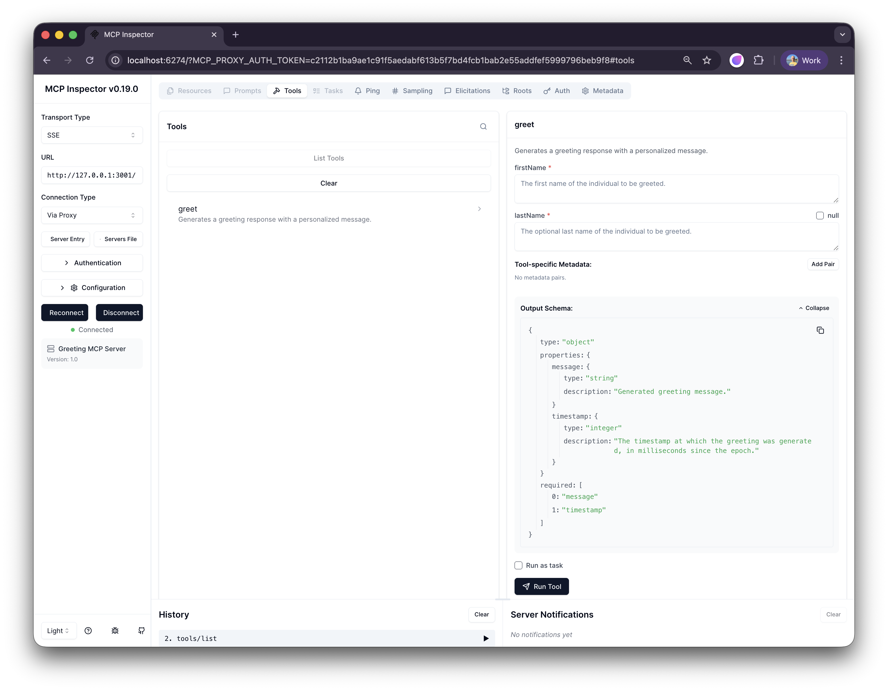

# Gradle + KSP Example

Demonstrates JSON Schema generation from Kotlin classes using KSP on a multiplatform project.

## Features

**Schema Generation**
- Sealed classes → `oneOf` polymorphic schemas
- Data classes → object schemas with property types
- Functions → function call schemas (for LLM tools)
- Default values → optional fields
- KDoc and `@Description` → schema descriptions

**MCP Server Integration**

Ktor-based MCP server with auto-generated tool schemas using
[Model Context Protocol Kotlin SDK](https://github.com/modelcontextprotocol/kotlin-sdk)

## Class schema

Annotate your classes:
```kotlin
@Schema
sealed class Shape {
    @Schema
    data class Circle(
        @Description("Radius in units")
        val radius: Double
    ) : Shape()
}
```

Access generated schemas:
```kotlin
val schema: String = Shape::class.jsonSchemaString
val json: JsonObject = Shape::class.jsonSchema
```

## Function call schema (MCP server)

The following example demonstrates how to use generated schema in MCP server:
```kotlin
/**
 * Response to a greeting request.
 *
 * @property message Generated greeting message.
 * @property timestamp The timestamp at which the greeting was generated, in milliseconds since the epoch.
 */
@Schema
@Serializable
internal data class GreetingResponse(
    val message: String,
    val timestamp: Long,
)

/**
 * Generates a greeting response with a personalized message.
 *
 * @param firstName The first name of the individual to be greeted.
 * @param lastName The optional last name of the individual to be greeted.
 * @return A `GreetingResponse` containing the request ID, greeting message, and generation timestamp.
 */
@Schema
internal fun greet(
    firstName: String,
    lastName: String? = null,
): GreetingResponse = TODO("business logic")

val functionSchema = greetJsonSchema()
val toolName = requireNotNull(functionSchema["name"]?.jsonPrimitive?.content)
val toolDescription = requireNotNull(functionSchema["description"]?.jsonPrimitive?.content)
val paramsSchema = requireNotNull(functionSchema.jsonObject["parameters"]?.jsonObject)
val responseSchema = GreetingResponse::class.jsonSchema

// MCP Server
val mcpServer = Server(
        Implementation("Greeting MCP Server","1.0"),
        ServerOptions(
            capabilities =
                ServerCapabilities(
                    tools = ServerCapabilities.Tools(),
                ),
        ),
    )

mcpServer.addTool(
    name = toolName,
    description = toolDescription,
    inputSchema =
        ToolSchema(
            properties = paramsSchema["properties"]?.jsonObject,
            required = paramsSchema["required"]?.jsonArray?.map { it.jsonPrimitive.content },
        ),
    outputSchema =
        ToolSchema(
            properties = responseSchema["properties"]?.jsonObject,
            required = responseSchema["required"]?.jsonArray?.map { it.jsonPrimitive.content },
        ),
) { request -> TODO("handle request") }

// create and run Ktor server
embeddedServer(CIO, host = "127.0.0.1", port = 3001) {
    mcp {
        return@mcp mcpServer
    }
}.start(wait = true)
```
A complete example is available here: [GreetingMcpServer.kt](src/commonMain/kotlin/com/example/mcp/GreetingMcpServer.kt)

When you start the server, you may inspect the tool metadata 
with [MCP inspector](https://modelcontextprotocol.io/docs/tools/inspector):


## Build & Run

```bash
# Generate schemas and build
./gradlew build

# Run MCP server example
./gradlew :examples:gradle-google-ksp:jvmRun

# Run tests
./gradlew :examples:gradle-google-ksp:test
```

## Key Files

- `Shapes.kt` — Sealed classes and function schemas
- `GreetingMcpServer.kt` — MCP server with auto-generated tool schemas
- `build.gradle.kts` — KSP configuration and multiplatform setup

## KSP Configuration

```kotlin
ksp {
    arg("kotlinx.schema.withSchemaObject", "true")  // Generate JsonObject accessor
    arg("kotlinx.schema.visibility", "internal")     // Control generated code visibility
}

dependencies {
    add("kspCommonMainMetadata", "org.jetbrains.kotlinx:kotlinx-schema-ksp:$version")
}
```

See [main documentation](../../README.md) for setup details.
